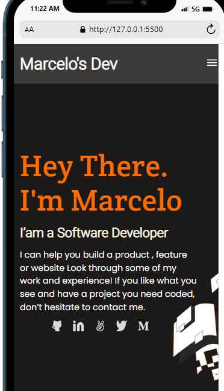
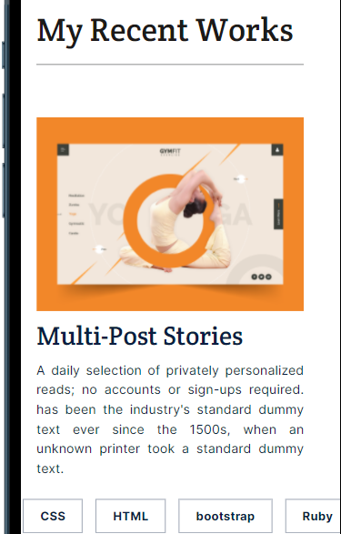
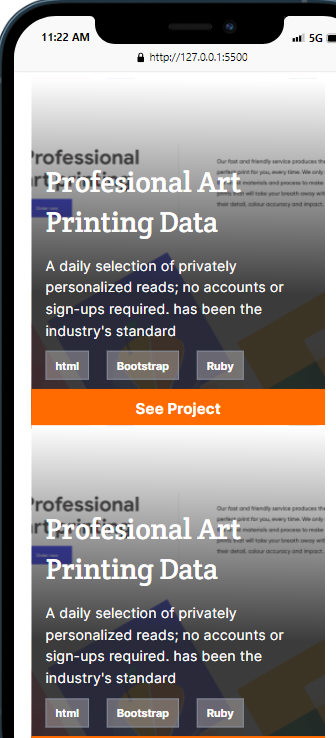
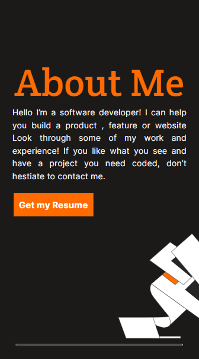
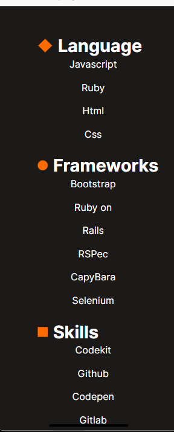
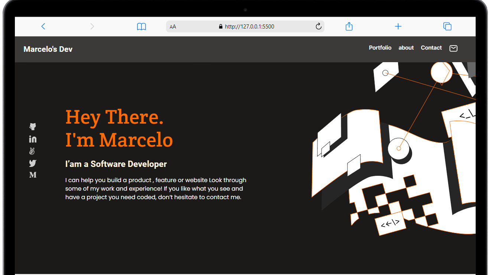
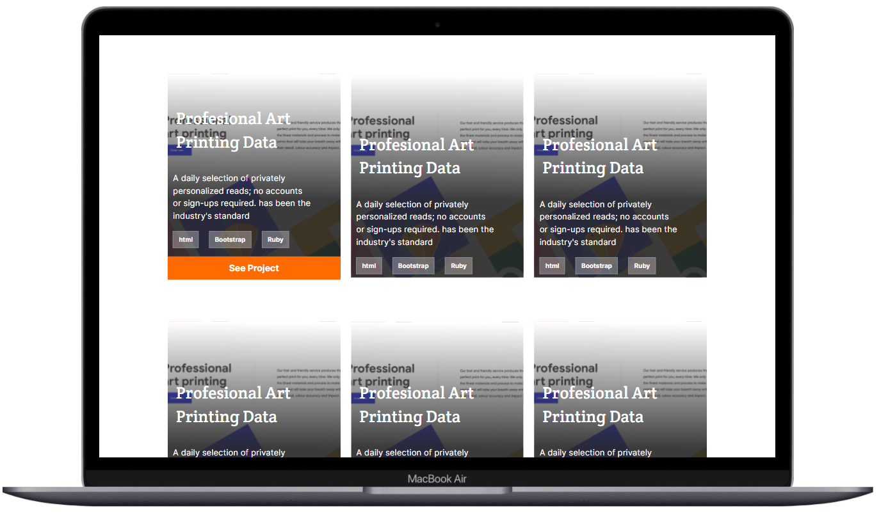
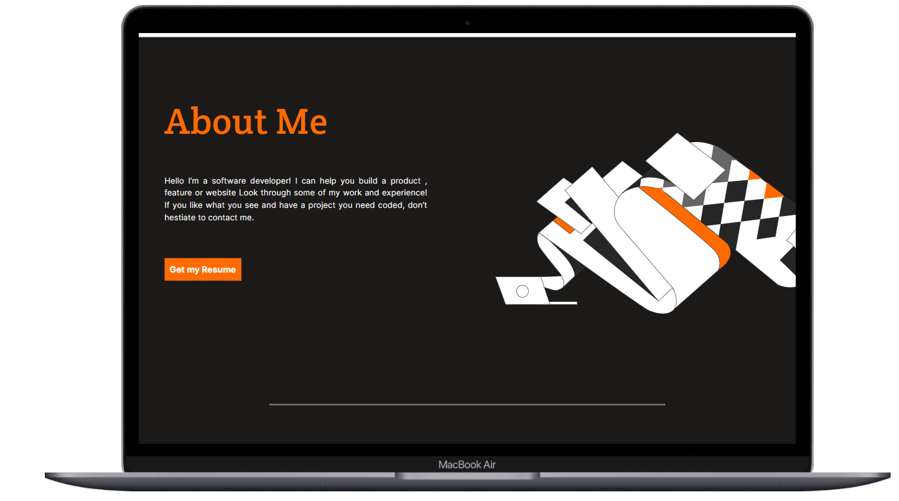
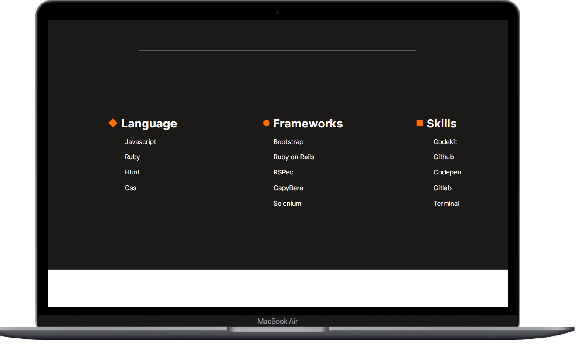

# Portfolio-MY21-Marcelo

My Portfolio of Web Development

> Project created for my first mobile version of my Portfolio

This project is an asset because it will set the foundations of my web development journey.

- Showcase abilities, languages, frameworks of diverse and interest projects for reference with anyone in the World.

## Getting Started

To get a local copy up and running follow these simple steps.

- You can clone this repo by typing `git clone https://github.com/marcelosdata/Portfolio-MY21-Marcelo.git`

- Type `cd marcelo-portfolio` to access the project on the terminal

## Built With

- HTML
- CSS
- Linter
- Figma

## Author

👤 **Author**

- GitHub: [@marcelosdata](https://github.com/marcelosdata)
- Twitter: [@marcelo90](https://twitter.com/marcelo90)
- LinkedIn: [msn9](https://www.linkedin.com/in/msn9)

## 🤝 Contributing

Contributions, issues, and feature requests are welcome!

### List of Contribuitors
-Kyrillos Hany [@Bondok6](https://github.com/Bondok6/)

## 📝 License

This project is [MIT](./MIT.md) licensed.

## Copyright 2021, [MARCELO SALAZAR NAJAR]

Permission is hereby granted, free of charge, to any person obtaining a copy of this website and associated documentation files, to deal in the website without restriction, including without limitation the rights to use, copy, modify, merge, publish, distribute, sublicense, and/or sell copies of the website, and to permit persons to whom the website is furnished to do so, subject to the following conditions:

The above copyright notice and this permission notice shall be included in all copies or substantial portions of the website.

THE WEBSITE IS PROVIDED "AS IS", WITHOUT WARRANTY OF ANY KIND, EXPRESS OR IMPLIED, INCLUDING BUT NOT LIMITED TO THE WARRANTIES OF MERCHANTABILITY, FITNESS FOR A PARTICULAR PURPOSE AND NONINFRINGEMENT. IN NO EVENT SHALL THE AUTHORS OR COPYRIGHT HOLDERS BE LIABLE FOR ANY CLAIM, DAMAGES OR OTHER LIABILITY, WHETHER IN AN ACTION OF CONTRACT, TORT OR OTHERWISE, ARISING FROM, OUT OF OR IN CONNECTION WITH THE WEBSITE OR THE USE OR OTHER DEALINGS IN THE WEBSITE.

[Back To The Top](#Portfolio-MY21-Marcelo)
